<p align="center">
  
</p>

<h1 align="center">Open Accountant</h1>

<p align="center">
  <strong>Your AI bookkeeper. Follow the money.</strong><br>
  Privacy-first financial assistant for your terminal.
</p>

<p align="center">
  <a href="https://github.com/openaccountant/wilson/actions/workflows/ci.yml"></a>
  <a href="LICENSE"></a>
</p>

---

<p align="center">
  <a href="demos/media/hero-card.mp4">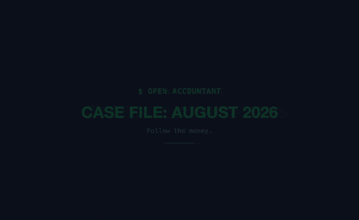</a>
</p>

Import bank statements, categorize transactions with AI, surface spending anomalies, and get actionable advice — all without your financial data leaving your machine.

Named after [Frank J. Wilson](https://en.wikipedia.org/wiki/Frank_J._Wilson), the forensic accountant who followed the money to convict Al Capone.

## See it in action

All demos run against a synthetic `demo` profile, so no real financial data is shown. Click any GIF for the full-quality MP4. Branded versions with title cards (`*-card.mp4`) and the recording pipeline are in [`demos/`](demos/README.md).

<table>
<tr>
<td width="50%" valign="top">
<a href="demos/media/flow1-help-import.mp4">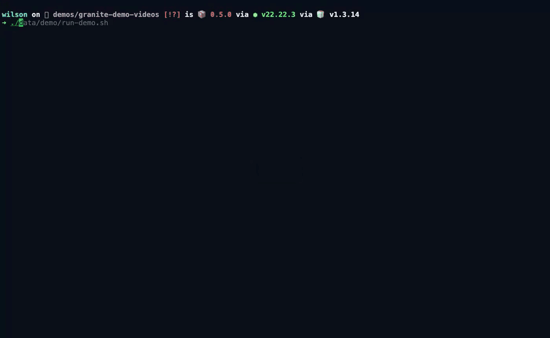</a><br>
<strong>Import a statement</strong><br>
<code>/help</code>, then import a Chase CSV in one line.
</td>
<td width="50%" valign="top">
<a href="demos/media/oa-tui-dining.mp4"></a><br>
<strong>Ask where the money went</strong><br>
"How much did I spend on dining and coffee in August?"
</td>
</tr>
<tr>
<td width="50%" valign="top">
<a href="demos/media/oa-tui-duplicate.mp4">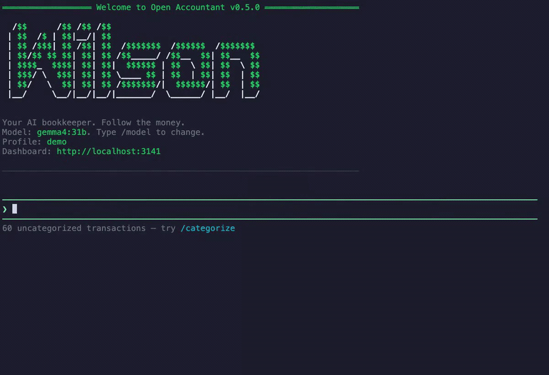</a><br>
<strong>Catch duplicate charges</strong><br>
Flags the same charge billed twice.
</td>
<td width="50%" valign="top">
<a href="demos/media/orchestration.mp4">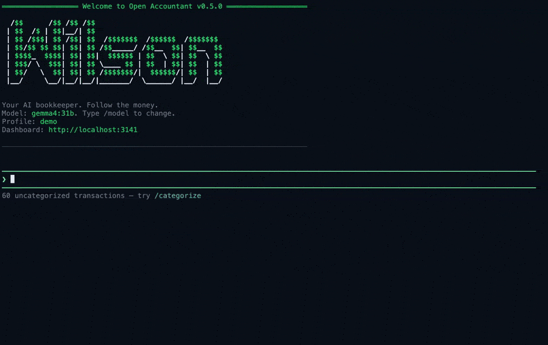</a><br>
<strong>Chain tools together</strong><br>
Duplicates + recurring charges → the top money-saving actions.
</td>
</tr>
<tr>
<td width="50%" valign="top">
<a href="demos/media/flow3-budget.mp4">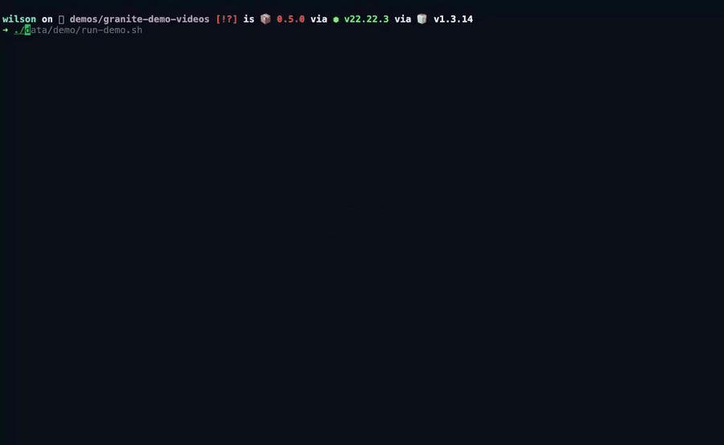</a><br>
<strong>Budgets</strong><br>
Set category budgets and check how the month is tracking.
</td>
<td width="50%" valign="top">
<a href="demos/media/flow-goal.mp4">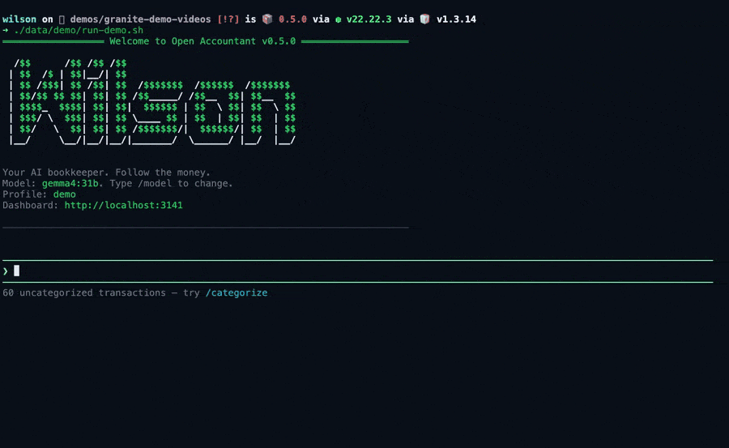</a><br>
<strong>Savings goals</strong><br>
Create a goal, record progress, see percent complete.
</td>
</tr>
<tr>
<td width="50%" valign="top">
<a href="demos/media/flow2-skill.mp4">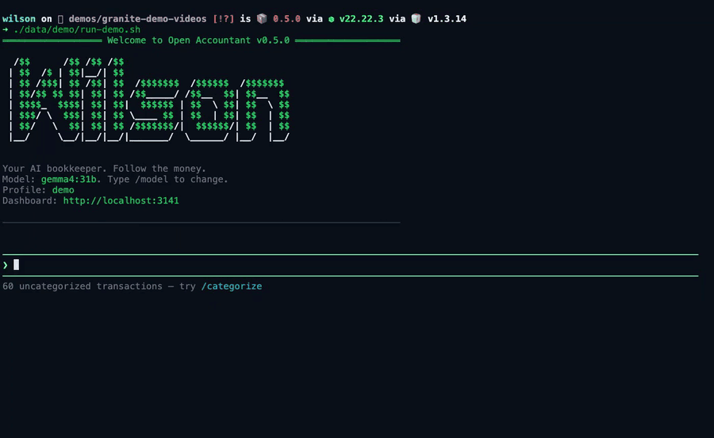</a><br>
<strong>Skills</strong><br>
Run a multi-step workflow with <code>/skill spending-review</code>.
</td>
<td width="50%" valign="top">
<a href="demos/media/sovereignty.mp4">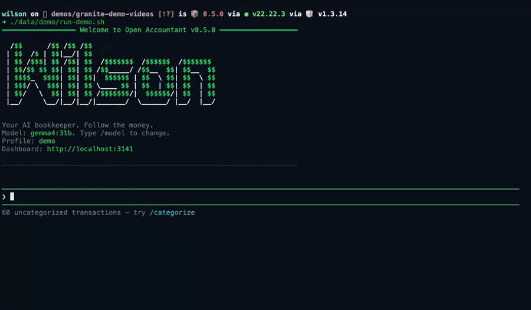</a><br>
<strong>Your data stays local</strong><br>
Ask whether anything leaves your machine.
</td>
</tr>
<tr>
<td width="50%" valign="top">
<a href="demos/media/oa-cli-summary.mp4">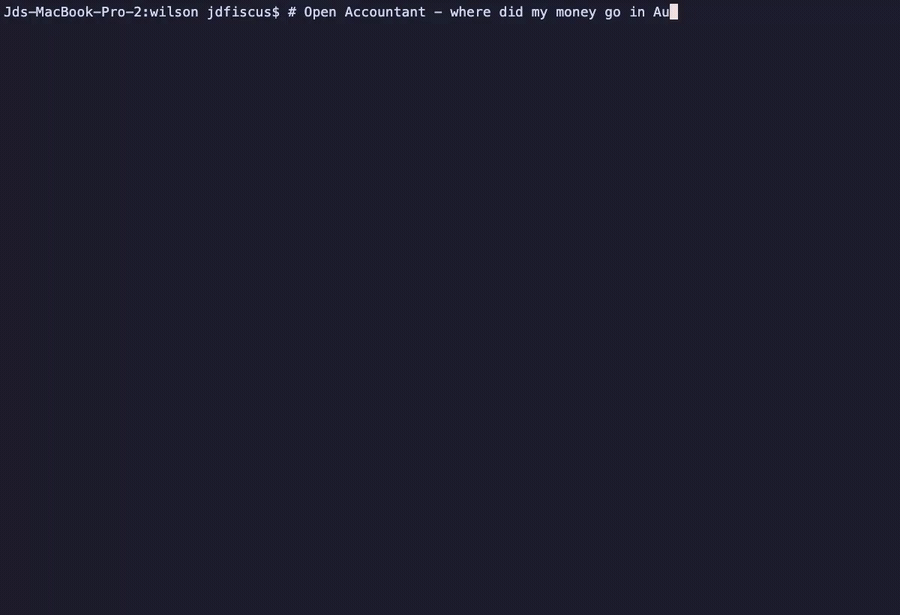</a><br>
<strong>Headless mode</strong><br>
<code>wilson --run</code> for one-shot answers from scripts.
</td>
<td width="50%" valign="top">
<a href="demos/media/dashboard-overview.mp4">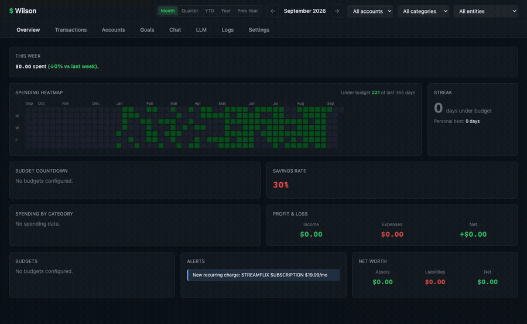</a><br>
<strong>Dashboard</strong><br>
The web dashboard overview.
</td>
</tr>
<tr>
<td width="50%" valign="top">
<a href="demos/media/dashboard-transactions.mp4">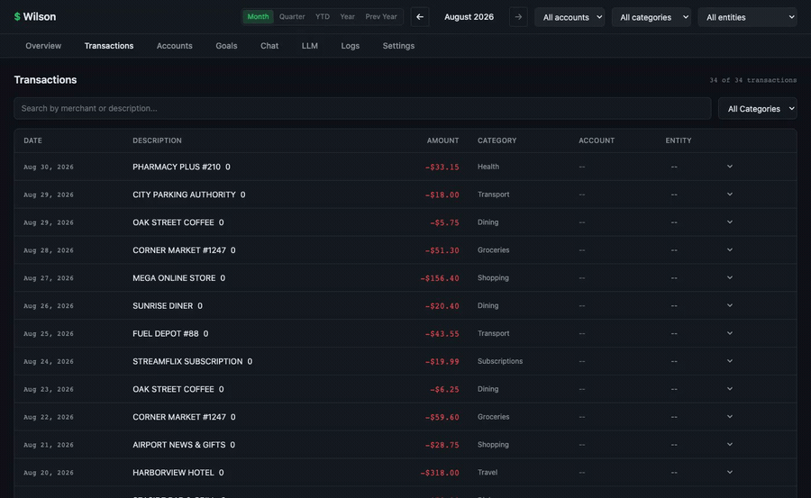</a><br>
<strong>Dashboard transactions</strong><br>
Browse and search transactions.
</td>
<td width="50%" valign="top">
<a href="demos/media/dashboard-training.mp4">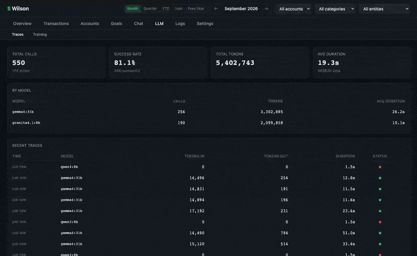</a><br>
<strong>Dashboard training</strong><br>
Rate agent interactions and export SFT/DPO training data.
</td>
</tr>
</table>

## Features

- **Bank CSV import** — Auto-detects Chase, American Express, and generic CSV formats
- **Monarch Money sync** — Pull transactions directly from your Monarch Money account
- **AI categorization** — Classifies transactions into 18 spending categories using your choice of LLM
- **Spending summaries** — Breakdowns by category, merchant, or time period with comparisons
- **Anomaly detection** — Flags duplicate charges, unusual spikes, and forgotten subscriptions
- **Export** — Save filtered transactions to CSV or XLSX
- **Web search** — Research merchants and financial questions (Exa, Perplexity, Tavily, Brave)
- **MCP extensibility** — Add tools via Model Context Protocol servers
- **Orchestration** — Chain tools sequentially or run parallel teams for complex workflows
- **Skills** — Multi-step workflows like subscription audits, extensible with custom skills
- **Semantic transaction search** — The dashboard Transactions search understands meaning, not just substrings: a query with no exact matches falls back to on-device embedding search (`wilson --index` builds the vectors) with ranked, scored results — nothing but the one-time model download ever leaves the machine
- **9 LLM providers** — OpenAI, Anthropic, Google, xAI, Moonshot, DeepSeek, OpenRouter, LiteLLM, and Ollama (local)
- **Offline dashboard transactions** — the dashboard keeps a sync-fed local mirror (wa-sqlite on OPFS, inlined in the single-file build); when the server is unreachable you can still browse, search, and filter transactions with the same results, and entity assignment shows an explicit "requires connection" state instead of failing silently
- **Offline overview cards** — the heatmap, streak, weekly summary, budget countdown, savings sparkline, category donut, P&L, and budget bars all recompute locally from the mirror (same SQL and math as the server); cards whose engine is server-side (alerts, net worth, cash forecast) say so explicitly instead of failing

## Offline transactions

The React dashboard stores a read-only mirror of the active profile's transactions, entities, budgets, and categories in the browser (wa-sqlite on OPFS, keyed per profile). While the server is reachable the mirror stays fresh via a periodic full pull; when the server is unreachable, the transactions tab serves browsing, search, and filtering from the last-synced mirror — the same results the server would return for the same query — and the overview tab renders its eight approved cards from locally recomputed aggregations (the server's own SQL constants and calendar/rollup math are shared code, so both sides agree by construction). Cards that depend on server-only state — the alerts engine, net worth/accounts, and the cash forecast — render an explicit "Unavailable offline" note rather than misleading zeros. Entity assignment (and every other write) stays online-only: offline it shows a "requires connection" state rather than failing silently, and nothing is queued.

Privacy note: the browser mirror is **unencrypted at rest** (browser origin storage holds plaintext, unlike the SQLCipher-encrypted CLI database). It mirrors exactly what the dashboard already renders in that same browser, it can be dropped and re-synced at any time, and full-disk encryption (e.g. FileVault) protects it at the OS layer.

## Quick Start

### Prerequisites

- [Bun](https://bun.sh) v1.1+
- An LLM provider: either [Ollama](https://ollama.com) running locally **or** an API key for a cloud provider

### Install & Run

```bash
git clone https://github.com/openaccountant/wilson.git
cd open-accountant
bun install
cp env.example .env   # edit with your API key(s)
bun start
```

### First Steps

1. **Import transactions** — Drop a CSV into the chat: `Import my transactions from ~/Downloads/chase.csv`
2. **Categorize** — `Categorize my uncategorized transactions`
3. **Explore** — `What did I spend on dining last month?`
4. **Audit** — `Find any unusual charges or forgotten subscriptions`

## LLM Providers

| Provider | Prefix | API Key Env Var |
|---|---|---|
| OpenAI | `gpt-` | `OPENAI_API_KEY` |
| Anthropic | `claude-` | `ANTHROPIC_API_KEY` |
| Google | `gemini-` | `GOOGLE_API_KEY` |
| xAI | `grok-` | `XAI_API_KEY` |
| Moonshot | `kimi-` | `MOONSHOT_API_KEY` |
| DeepSeek | `deepseek-` | `DEEPSEEK_API_KEY` |
| OpenRouter | `openrouter:` | `OPENROUTER_API_KEY` |
| LiteLLM | `litellm:` | `LITELLM_API_KEY` |
| Ollama | `ollama:` | None (local) |

Switch providers at any time with `/model`.

## CLI Commands

| Command | Description |
|---|---|
| `/model` | Switch LLM provider and model |
| `/pull <model>` | Download an Ollama model |
| `/skill <name>` | Run a skill (e.g. `/skill subscription-audit`) |
| `/help` | Show available commands |

Type `exit` or `quit` to close. Press `Esc` to cancel a running operation.

### Headless Flags

| Command | Description |
|---|---|
| `wilson --sync` | Sync all linked accounts (Plaid, Monarch, Firefly III) — cron-friendly |
| `wilson --index` | Build the local semantic index over existing transactions. Embeddings are computed and stored entirely on-device; only the embedding model itself is downloaded once, then cached in `~/.openaccountant/models/` |

## Configuration

### Environment Variables

Copy `env.example` to `.env` and set at least one provider API key. See the file for all options including web search keys and Ollama base URL.

### MCP Servers

Add external tool servers in `~/.openaccountant/mcp.json`:

```json
{
  "servers": {
    "my-server": {
      "command": "npx",
      "args": ["-y", "my-mcp-server"],
      "env": {},
      "readOnlyTools": ["search", "get_record"]
    }
  }
}
```

MCP tools appear automatically in Open Accountant's tool registry.

Every MCP tool is treated as one that can change things, so each call asks for
your approval. To let a tool run without asking, list it (by the server's own
tool name) in that server's `readOnlyTools`. Only tools you list there count as
read-only. A server's own `readOnlyHint` annotation is ignored, because a
server could mislabel a tool that writes. `readOnlyTools` must be an array of
strings; if it is not, it is ignored with a warning. Names the server does not
offer are also ignored with a warning. An MCP tool whose name is already taken
by a built-in or another tool is not registered.

### Custom Skills

Drop a folder with a `SKILL.md` file into any of these directories:

| Location | Purpose |
|---|---|
| `src/skills/` | Built-in skills |
| `~/.openaccountant/skills/` | User-wide skills |
| `.openaccountant/skills/` | Project-specific skills |

Skills defined later in this list override earlier ones with the same name.

## Architecture

```
src/
  agent/          # Core agent loop, tool execution, context management
  components/     # TUI components (chat log, editor, prompts)
  controllers/    # Agent runner, model selection, input history
  db/             # SQLite schema, queries, database init
  mcp/            # MCP client, adapter, config
  model/          # LLM abstraction and provider implementations
  orchestration/  # Chains (sequential) and Teams (parallel) workflows
  skills/         # Skill discovery, loading, and built-in skills
  tools/          # All tool implementations
    categorize/   # AI transaction categorization
    export/       # CSV/XLSX export
    import/       # CSV import with bank parsers, Monarch sync
    query/        # Transaction search, spending summary, anomaly detection
    search/       # Web search providers (Exa, Perplexity, Tavily, Brave)
  utils/          # Shared utilities
```

All data is stored locally in `~/.openaccountant/data.db` (SQLite).

## Contributing

Contributions are welcome! Please open an issue first to discuss what you'd like to change.

See the [issue templates](.github/ISSUE_TEMPLATE) for bug reports and feature requests.

## License

[MIT](LICENSE)
